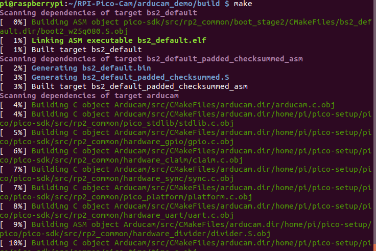

# PICO Arducam Examples

## Getting started

See [Getting Started with the Raspberry Pi Pico](https://rptl.io/pico-get-started) and the README in the [pico-sdk](https://github.com/raspberrypi/pico-sdk) for information
on getting up and running.

# Quick Pico Setup
If you are developing for Raspberry Pi Pico on the Raspberry Pi 4B, or the Raspberry Pi 400, most of the installation steps
in this Getting Started guide can be skipped by running the setup script. You can get this script by doing the following:
```bash
git clone https://github.com/raspberrypi/pico-setup.git
```
Then run: 
```bash
 pico-setup/pico_setup.sh
```
The script will:

- Create a directory called pico
- Install required dependencies
- Download the pico-sdk, pico-examples, pico-extras, and pico-playground repositories
- Define PICO_SDK_PATH, PICO_EXAMPLES_PATH, PICO_EXTRAS_PATH, and PICO_PLAYGROUND_PATH in your ~/.bashrc
- Build the blink and hello_world examples in pico-examples/build/blink and pico-examples/build/hello_world
- Download and build picotool (see Appendix B). Copy it to /usr/local/bin. • Download and build picoprobe (see Appendix A).
- Download and compile OpenOCD (for debug support)
- Download and install Visual Studio Code
- Install the required Visual Studio Code extensions (see Chapter 6 for more details)
- Configure the Raspberry Pi UART for use with Raspberry Pi Pico

Once it has run, you will need to reboot your Raspberry Pi,
```bash
sudo reboot
```

### Get Arducam
- Download RPI-Pico-Cam
```bash 
git clone https://github.com/ArduCAM/RPI-Pico-Cam.git
```
- Compile 
```bash
cd RPI-Pico-Cam
```
```bash
mkdir build 
```
```bash 
cd build 
```
```bash 
cmake ..
```

```bash
make
```

Then you will creat some files under RPI-Pico-Cam/build/Arducam path 
[arducam_demo.elf](arducam_demo) | which is used by the debugger.
[arducam_demo.uf2](arducam_demo) | which can be dragged onto the RP2040 USB Mass Storage Device.


### Test Arducam demo 

App|Description
---|---
[Arducam](arducam_demo) | This is a video streaming demo.

- Hardware connection 

- Load and run arducam_demo 
The simplest method to load software onto a RP2040-based board is by mounting it as a USB Mass Storage Device.
Doing this allows you to drag a file onto the board to program the flash. Go ahead and connect the Raspberry Pi Pico to
your Raspberry Pi using a micro-USB cable, making sure that you hold down the BOOTSEL button to force it into
USB Mass Storage Mode.

If you are logged in via ssh for example, you may have to mount the mass storage device manually:
```bash
$ dmesg | tail
[ 371.973555] sd 0:0:0:0: [sda] Attached SCSI removable disk
$ sudo mkdir -p /mnt/pico
$ sudo mount /dev/sda1 /mnt/pico
```
If you can see files in /mnt/pico then the USB Mass Storage Device has been mounted correctly:
```bash
$ ls /mnt/pico/
INDEX.HTM INFO_UF2.TXT
Copy your arducam_demo.uf2 onto RP2040:
sudo cp arducam_demo.uf2 /mnt/pico
sudo sync
```


