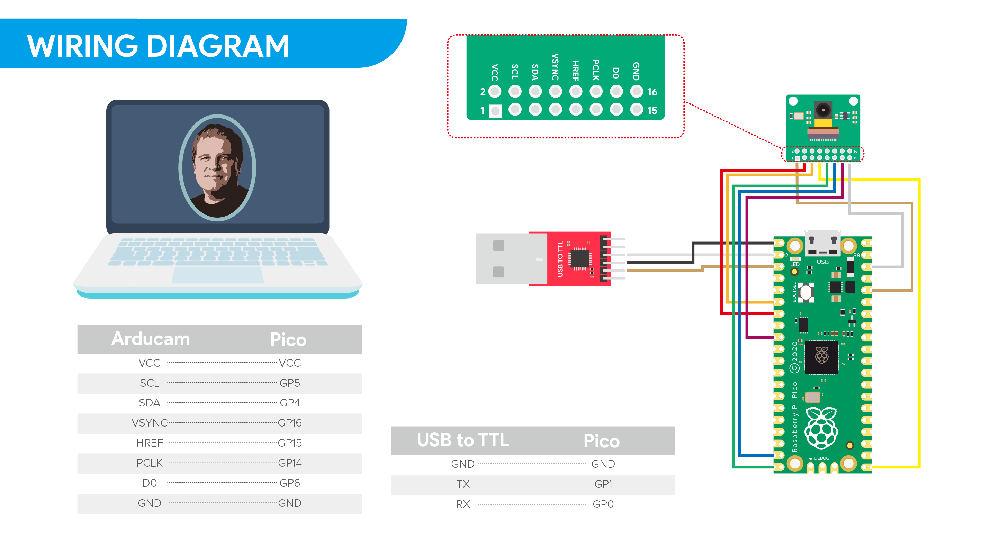

# Arducam hm01b0 demo 
## Hardware Connection

## Clone Arducam library 
```bash
    git clone https://github.com/ArduCAM/RPI-Pico-Cam.git
```
## Compile 
```bash
    cd RPI-Pico-Cam/tree/master/rp2040_hm01b0
    mkdir build
    cd build
    cmake ..
    cd build 
    make 
```